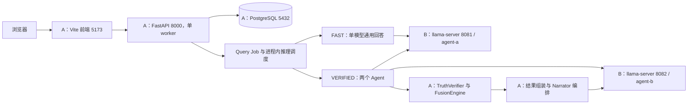

# RigBuilder Plan V4.3：双设备双 Agent 架构、推荐可信边界与性能质量整改

> 日期：2026-09-15。性质：**当前代码核查报告 + 下一阶段实施与验收计划**，不是本版本功能全部完成的声明。
>
> 继承：[Plan_V4.md](Plan_V4.md)，包括其中追加的 V4.1、V4.2 和预算回退记录；部署依据：[Quick_Start_Guide.md](../Quick_Start_Guide.md)。V4.3 独立成文，不改写 V4 历史。
>
> 核查范围：`D:\RigBuilder` 当前工作树、现有测试、发布文件与本对话反馈。Git HEAD 为 `0c47269846a343d935bd6a91170e6dab605f9d91`，**大量本次讨论涉及的修改尚在工作树中，因此 HEAD 本身不能复现本文全部状态**。
>
> 本轮只编写文档并进行离线检查；没有启动前后端服务、推理服务，没有执行真实推理、数据库迁移或数据导入。设备 A/B 联通、GPU 资源和在线数据库状态不属于本轮已验证事项。

> **后续实施更新（2026-09-15 至 2026-09-16）：** 下文 §0–§12 保留编写时的核查快照，不应当作最新在线状态。后续提速、质量修复、数据真实性、性能政策、游戏门禁、会话连贯性与用户体系准备已统一收敛至 [Plan V4.5](Plan_V4.5.md)。用户曾认可约 10 秒的速度和输出结构，但追问跑题、稳定时延和完整质量验收仍不能由少量样本替代。

## 0. 必须首先明确的结论

**项目当前最大的问题仍然是无法实现可验证、稳定的提速，且真实回答效果不佳。** 两 Agent、精简工具集、压缩 Prompt、增加 FAST 回退等改动已经存在于代码中，但没有足够的当前端到端数据证明它们已经解决问题。用户提供的“耗时 200 多秒且没有结果”“已选显卡后无法推荐本地模型”“明确不查询仍进入数据库链路”等反馈，仍须按产品故障处理。

系统已有完整的数据库查询、证据核验、确定性融合、会话持久化和前端展示基础；但是，**链路存在、测试通过、返回 completed，都不等于推荐可用**。其中，completed 还可能代表未核验的 FAST 回退，而不是 VERIFIED 成功。

本版本对当前阶段的判断如下：

| 维度 | 当前结论 |
|---|---|
| 架构 | 已把代码固定为两个 Agent，并把部署指南恢复为 A 服务端 + B 推理端；实际远程部署尚需验收 |
| 可信基础 | TruthVerifier、只读数据库工具、候选淘汰与确定性融合已实现并通过现有离线测试 |
| 回答可用性 | 只完成部分修复；意图误判、失败回退遗漏、上下文与证据补全问题仍存在 |
| 回答质量 | 有用户认可的单次显卡推荐，但基本追问仍失败；理由与证据对需求的覆盖不足 |
| 性能 | 有减少工作量的代码改动，没有当前双设备双 Agent 的前后对照；30 秒目标未验收 |
| 用户体系 | V4 规划的用户、鉴权、会话归属、管理员用户管理仍未实现 |
| 文档与测试 | 本轮重新确认离线基线；旧 API 文档仍未覆盖新增契约，在线体验验证仍缺失 |

V4.3 的优先顺序是：**先让基础问题得到正确类别的回答、让 VERIFIED 失败可控，再减少真实推理成本，最后扩展用户体系与其他功能。** 不继续用功能数量或测试数量替代速度与效果验收。

## 1. 核查口径与历史修正

### 1.1 状态定义

本文采用四类状态，避免“已完成”的含义漂移：

- **已实现并离线验证**：代码路径存在，对应离线测试或本轮静态复现支持该结论；不推导出在线效果。
- **部分实现**：主干已加入，但存在已知遗漏、契约不一致或没有覆盖关键情形。
- **未实现**：当前代码、迁移或界面中没有对应功能。
- **待在线验收**：需要设备 A/B、真实模型或真实数据库支持，本轮没有运行验证。

本轮测试数据属于当前工作树。历史耗时与用户反馈另行标注来源；不把不同模型、不同预算、不同 Agent 数量和不同测试选择范围的数据直接比较。

### 1.2 对 Plan_V4 的承接与纠偏

| V4 中的描述或方向 | V4.3 的当前口径 |
|---|---|
| 三个常驻 Agent；普通问题可减少、复杂问题可加深 | 已被用户明确决定取代：所有 VERIFIED 请求固定两个 Agent，不再恢复第三个 |
| 后端与推理同机，或旧客户端—服务端指南 | 当前目标是 A 运行前后端和 PostgreSQL，B 运行两个推理实例；旧部署文档已不在当前工作树中 |
| V4 最初的“方案待评审” | V4 文末已追加部分实施记录；必须逐项看当前代码，不能把正文计划视为完成清单 |
| “自然语言输出没有实现” | 不成立。Narrator、确定性模板、PresentationResult 均存在；缺口在输出质量与耗时 |
| “只有用户体系没有做” | 不足以描述当前状态。基础问答路由、失败回退和推荐效果同样没有完成产品验收 |
| “prefill 瘦身是 30 秒目标的唯一路径” | 证据不足。还必须检查排队、调用轮数、生成量、修复、共享 GPU 竞争、Narrator 和回退成本 |
| V4.1/V4.2 的测试数量、旧报告链接 | 作为历史记录保留；当前测试基线见 §10，旧报告已删除的链接不作为本版可复查证据 |

特别说明：历史中出现过“预算收紧导致失败”的对照记录，它说明预算和任务量有耦合，不能证明所有当前失败都由预算造成；同样，单条旧 `prompt_eval_duration_ms` 不能乘以调用次数就当作新的端到端实测。

## 2. 当前架构：设备 A + 设备 B，固定两个 Agent

### 2.1 部署拓扑



图中 FAST 和 Narrator 的实例归属按快速启动指南的推荐配置绘制；实际由 `LLM_BASE_URL/LLM_MODEL` 和 `NARRATOR_PROFILE_ID` 决定。Narrator 在 A 编排，在 B 执行模型推理，不是第三个常驻 Agent。

**设备 A/B 是机器，agent-a/agent-b 是推理服务别名，二者没有一一对应关系。** 当前指南示例中两个实例使用同一份 `Qwen3.5-4B-Q4_K_M.gguf`。两个不同模型 ID 只代表两个调用身份，不代表两个不同权重模型，也不能据此声称独立专家共识。

| 设备 | 职责 | 当前边界 |
|---|---|---|
| A | 前端、API、Job、上下文、数据库工具、TruthVerifier、融合、结果持久化 | FastAPI 保持单 worker；只读 Agent 数据库连接与应用连接分离 |
| B | 两个 llama-server，按 profile 提供 OpenAI 兼容推理接口 | 8081/8082 对 A 可达；实际 GPU offload、显存占用、工具协议需验证 |
| 浏览器 | 访问 A，展示 Job 和结果、轮询/SSE、取消任务 | 不直接连接 B，不持有数据库凭据或模型 API key |

### 2.2 已完成的固定双 Agent 改动

依据：[profiles.py](../../backend/app/inference/profiles.py)、[routing.py](../../backend/app/services/routing.py)、[fusion.py](../../backend/app/services/fusion.py)、[model_comparison.py](../../backend/app/services/model_comparison.py)。

1. `PROFILE_ORDER = ("agent-a", "agent-b")`，`AGENT_COUNT = 2`；不再构建 agent-c profile。
2. `FusionService.run()` 在推理前要求恰好两个不同模型 ID；零个、一个、三个、四个或重复 ID 均不能作为合法 VERIFIED 配置。
3. `select_agent_models()` 固定取两个不同 ID，复杂度和旧自适应数量配置不再增加 Agent。
4. 两 profile 的 URL 互异且模型 ID 顺序一致等条件成立时，使用并行 worker；每个 worker 使用独立数据库 session，失败隔离保留。
5. 共享 Router 等不满足并行条件的配置仍保留串行路径。**固定两个 Agent 不代表必然并行。** 配置诊断和运行时协议能力仍需分别检查。
6. 一个 Agent 有效、另一个失败时允许部分覆盖结果；双 Agent 下此时 `agent_coverage = 0.5`，不能显示为双模型完整共识。
7. 比较页固定两个输入身份，并按各 profile 的实际 endpoint 调用；不再把两次比较都发往默认地址。
8. 启停脚本默认端口与模板已改为 8081/8082；本地覆盖配置要求固定的 agent-a、agent-b 顺序及不同端口。

FAST 仍是单模型调用，固定两个 Agent 的要求作用于 VERIFIED 编排和双模型比较，不要求普通问答也调用两个模型。

### 2.3 已写入文档、但尚未证明实际部署完成的部分

[Quick_Start_Guide.md](../Quick_Start_Guide.md) 已包含 B 的两个前台启动命令、A 的后端与前端配置、网络放行、端点检查、UTF-8 Job 请求和验收步骤。示例 IP `192.168.1.10/192.168.1.20` 是占位地址，不是本轮发现的机器地址。

远程部署仍使用该指南的分设备命令：`start_local_stack.ps1` 仍是本地脚本，其推理监听回环地址，且后端启动时会覆盖 `NO_PROXY` 为本地地址；仅使用 `-SkipInference` 不能完整表达远程部署。`stack_status.ps1` 仍检查本机推理端口，在 A 上出现缺少 8081/8082 的提示不等于 B 不可用。

后续应把本地/远程部署模式、代理绕过和远程探活做成显式配置，消除“文档正确、脚本仍按旧假设执行”的差异。该脚本改造**尚未完成**。

### 2.4 双实例的性能限制

两个进程在同一张 GPU 上可能竞争计算、显存带宽与 KV cache；并行窗口重叠只能证明任务并发，不能证明更快。三 Agent 减为两个可减少总工作量和常驻资源，但并行总耗时取决于最慢路径，不能直接推出耗时减少三分之一。

跨 Job 的 `asyncio.Semaphore(1)` 仍是全局进程内串行闸门，FAST 也使用它。因此长 VERIFIED Job 可能阻塞后来的短 FAST 请求。拆为两台设备不会自动消除此排队，也不会减少模型需要执行的轮数。

## 3. Plan_V4 目标与当前完成度总表

| 项目 | 状态 | 已完成部分 | 仍需改进/验收 |
|---|---|---|---|
| 模型网关与 profile | 已实现并离线验证 | 双身份、独立 endpoint、并行判定、比较页真实 endpoint 调用 | B 的加载状态、工具协议、GPU offload、资源竞争 |
| 固定两 Agent | 已实现并离线验证 | 配置门禁、普通/复杂请求均两 Agent、失败隔离与覆盖率 | 真实延迟与成功率对照 |
| 查询意图路由 | 部分实现 | 明确若干“不查库”短语与中文本地模型问题可进 FAST | 规则过宽、英文表达漏判、核验意图冲突、跨轮指代 |
| FAST 一般知识建议 | 部分实现 | Prompt 允许在不查库建议中给具体产品/模型名 | 回退上下文未明确、过度拒绝、格式残留、声明非强制校验 |
| VERIFIED → FAST 回退 | 部分实现 | 部分失败响应触发一次 ChatService，保存 chat_fallback | 总超时/异常/空 top_k、重复用户消息、统一错误与总预算 |
| SQL 工具和证据返回 | 已实现并离线验证 | 只读门禁、视图白名单、字段映射、row_bindings、结果裁剪 | 按任务提供最小 schema、保证关键字段保留、减少结果重复 |
| Claims 修复与核验 | 部分实现 | 字段后缀安全归一、无 supported Claim 淘汰、最多六条 Claim | 自动补全字段契约错位；身份事实不等于需求证明 |
| 确定性融合 | 已实现并离线验证 | fusion-v1、硬约束淘汰、偏好与共识评分、稳定排序 | 自然语言偏好未形成完整确定性约束；候选覆盖偏差 |
| 核心配置组装 | 部分实现 | CPU/GPU 选择、配套规格推导、单品请求不生成整机 | CPU 缺失、部件搭配失衡、预算分配、缺口呈现 |
| PresentationResult/Narrator | 部分实现 | 已核验事实解释、证据列表、模板降级、结果投影 | 理由质量、关键需求覆盖、额外推理成本与模板使用率 |
| 前端简洁推荐 | 部分实现 | 主页 VERIFIED 显示推荐、理由、证据、有限说明 | FAST 仍显示 model；运行文案误称查库；纯文本格式问题 |
| Job、SSE、取消与历史 | 已实现并离线验证 | 异步任务、进程内取消、事件与结果持久化、重启失败标记 | 语义化状态、回退生命周期、独立的性能质量统计 |
| 上下文 | 部分实现 | 历史裁剪、快照结构、工具上下文预算、服务端 tokenize 支持 | 重复消息、结构化结果过大、指代锚点、两套估算口径 |
| 用户系统 | 未实现 | 现有共享会话可用 | 用户表、登录、归属隔离、令牌、速率限制、用户管理 |
| 管理界面 | 部分实现 | 只读统计、端点和数据库概览 | 管理员权限、用户写操作、FAST/回退/VERIFIED 分组统计 |
| API V4 文档 | 未实现 | 现存 V3/V3.1 文档与代码契约 | 新结果类型、模式优先级、失败策略与权限规范未系统补齐 |
| 当前实测提速 | 未验收 | 离线计数与结构优化可确认 | 同环境对照、TTFT、p50/p95、成功率与质量联合验收 |

## 4. 推荐算法、工具链与证据边界

### 4.1 当前 VERIFIED 处理链

主页入口是 `ConversationTerminal → /api/query/jobs → QueryJobManager`，不是直接 `/api/agent/fusion`。同步 fusion 接口和 legacy 页仍存在，不能假设它们享有 Job 的所有回退策略。

VERIFIED 当前大致执行顺序为：

1. 校验双模型配置，进入包含排队时间的 Fusion 总超时预算。
2. 创建或读取会话，写入用户消息，准备历史上下文。
3. 构造 Agent Prompt；满足配置条件时并行执行两个 Agent。
4. Agent 查询只读视图，取得候选 ID、字段值及同实体证据绑定，提交结构化 Recommendation。
5. 执行结构修复、Claims 验证与 TruthVerifier；无有效候选的 Agent 不参与融合。
6. FusionEngine 在有效输入上确定性计算，淘汰不满足硬约束的候选并排序。
7. 保存结构化融合回答；按用户问题决定是否组装核心配置。
8. 调用 Narrator，失败则使用保留 Truth 约束的确定性模板。
9. Job 保存结果；部分 fusion 失败才进入当前的 FAST 回退分支。

### 4.2 fusion-v1 没有因为两 Agent 而重写

依据：[engine.py](../../backend/app/fusion/engine.py)、[constraints.py](../../backend/app/fusion/constraints.py)。

候选按 `(candidate_type, candidate_id)` 归并，同一模型内去重。设有效 Agent 数为 `N_valid`，当前配置数量为 2：

```text
consensus = Σ(1 / 该候选在贡献 Agent 中的排名) / N_valid
agent_coverage = N_valid / 2

有 preference 约束：
preference_utility = 已满足偏好的权重和 / 全部偏好的权重和
recommendation_score = 100 × (0.70 × preference_utility + 0.30 × consensus)

无 preference 约束：
preference_utility 记录为 0.5
recommendation_score = 100 × consensus

credibility = 100 × (
    0.40 × fact_support
  + 0.25 × proof_coverage
  + 0.20 × information_completeness
  + 0.15 × consensus × agent_coverage
)
```

其中，`fact_support` 是非 preference Claims 的 supported 比例；`proof_coverage` 是有有效证明引用的 supported 比例；`information_completeness` 统计 supported 或 conflict 的比例。这些指标的分母是**实际提交的 Claims**，不是用户问题所需的全部事实。

所有 hard constraints 必须为 satisfied；候选级失效原因以及关键字段冲突会进入淘汰原因。排序顺序保持：推荐分降序、可信度降序、共识降序、类型升序、ID 升序。模型自报 score/confidence 可留作诊断，但不直接进入上述公式。

**限制必须保留：**共识分不等于客观适配度，credibility 不等于回答正确概率。同权重模型重复选择同一候选也不代表独立外部验证；只提交名称事实可能得到很好的 Claim 比例，却没有证明显存、功耗或运行能力。

当前融合调用把传入的 `constraints` 交给确定性评估器；本轮没有发现把任意自然语言偏好自动转换为完整 ConfirmedConstraint 的通用实现。Prompt 中的“偏好优先”和 Narrator 的“该功耗已进入权衡”，不能单独证明算法确实执行了可复查的功耗比较。应记录实际约束来源和排序依据，减少只有措辞、没有决策证据的解释。

### 4.3 工具链缩短：主线已有改动，旧路径仍需区分

依据：[registry.py](../../backend/app/tools/registry.py)、[loop.py](../../backend/app/agents/loop.py)、[database.py](../../backend/app/tools/database.py)、[tables.py](../../backend/app/tools/tables.py)。

- 协议主线使用 `agent_database_tools()`，仅向模型提供 `query_database`；支持终局工具时增加 `submit_recommendation`。
- `inspect_database` 与 `resolve_evidence` 仍保留在兼容注册表和旧路径中，不能写成“从项目删除”。
- 查询选出 `entity_id` 和需要引用的事实列时，工具可同时返回 `row_bindings`，减少单独查证据的往返。
- 证据字段映射已按视图与列共同确定，避免 CPU/GPU 同名列混淆；name 可映射到 `entity.canonical_name`。
- `resolve_evidence` 在所需字段没有匹配时，不再自动退回名称证据。
- 重复 SQL 拒绝、SQL/轮数预算、结果字符预算和工具历史裁剪仍保留。不能通过放开任意 SQL 或降低 Truth 标准换取“成功”。

### 4.4 Claims 修复：已实现与未生效部分

依据：[verification/service.py](../../backend/app/verification/service.py)、[recommendation.py](../../backend/app/schemas/recommendation.py)。

已实现的保护包括：

1. 候选没有任何 supported 非 preference Claim 时加入 `no_supported_truth_claim`，不能仅凭实体存在就通过候选门禁。
2. 对 `vram_gib` 这类缺少命名空间的字段，只有引用的证据全部 accepted、属于同一实体、唯一指向同一个完整字段且后缀一致时，才进行确定性归一；不进行模糊猜测。
3. RecommendationItem 限制最多六条 Claims；部分实时 finalize schema 强制至少一条 Claim。但“有一条”本身不保证它是合格事实，最终仍依赖核验。
4. 推荐归一函数尝试从本轮工具证据补充显存、功耗、带宽等决策字段，并通过 Claim schema 校验。

**第 4 项存在本轮已复现的契约缺陷：**补全分支筛选 `item.get("accepted") is True`；真实 `_reverse_evidence` 描述包含 `evidence_id/entity_id/field_key/normalized_value/unit`，没有 `accepted`，`_remember_evidence` 也不会补该标记。以该描述结构输入归一函数时补全 0 条；仅在实验副本中额外加入 `accepted=true` 后补全 1 条。此实验不连接数据库、不更改发布数据，证明的是程序数据结构不匹配。

因此，当前不能宣称“模型遗漏显存已由后端可靠补齐”。后续应统一服务端可信证据描述契约，补上使用真实工具返回结构的集成测试；禁止让模型自行提供 accepted 标记作为可信依据。补全必须继续满足同实体、同字段、本轮已返回的证据，并再次通过 TruthVerifier。

### 4.5 核心配置组装不是完整装机求解

依据：[build_assembler.py](../../backend/app/services/build_assembler.py)。当前先按融合排序选择每个角色的首个候选，再从数据库推导平台、内存代际、电源和场景存储规格。电源推导使用 CPU 最大功耗（缺失则基础功耗）与 GPU 板卡功耗，加 120W 余量，向上选择数据库电源档位。

本对话中已修复单品扩张问题：即使同类候选有多个，只要请求未被判断为 bundle，就不生成核心配置。仍未实现 CPU/GPU 联合优化、预算分配、场景适配约束和缺 CPU 的确定性补选。取每类第一名仍可能拼出档次不协调的组合；`top_k` 截断也可能影响角色覆盖。由 socket 推导内存代际不是具体主板、BIOS、散热与机箱兼容性的证明。

对配套硬件必须保留“场景需求 / 规则推导 / 未收录”的依据区别，不把规则推导表述为具体产品已核验。

## 5. FAST、VERIFIED 与回退：当前行为和目标行为

### 5.1 当前路由不是 LLM 自主决策

`resolve_query_mode()` 是字符串规则，不是模型推理式意图分类。优先级实际为：

```text
命中特定不查库短语 → chat
包含“本地模型”且包含“运行/适合/推荐”之一 → chat
UI/API 显式 chat 或 fusion → 使用显式模式
存在结构化 constraints → fusion
auto 中 domain 与 decision 词共同命中 → fusion，否则 chat
```

本轮直接调用路由函数，全部以 `requested="fusion"` 输入，结果如下：

| 输入 | 当前输出 | 判断 |
|---|---|---|
| 推荐一个入门级显卡，不要查询数据库，用你自己的知识回答。 | chat | 命中明确退出查库的意图，符合要求 |
| 那你给我推荐一个适合这款显卡运行的本地模型吧 | chat | 符合该基础追问的预期；不证明回答已正确理解上轮显卡 |
| 请推荐一款适合本地模型的显卡 | chat | 误判；推荐对象是硬件，却被宽泛本地模型规则截走 |
| 请查询数据库，推荐适合运行的本地模型 | chat | 误判；明确核验要求被覆盖 |
| Recommend a local model for this GPU | fusion | 英文兼容性追问没有获得对应 FAST 规则 |
| Recommend a GPU without querying the database | fusion | 英文不查库表达漏判 |

这里的 `chat` 就是界面 FAST。测试是纯函数执行，不代表发起了任何模型调用。

### 5.2 V4.3 目标路由规则（尚待实施）

| 优先级 | 意图 | 目标处理 |
|---|---|---|
| 1 | 明确“不查询数据库 / 不查库 / 用自己的知识”，含常见中英文变体 | FAST，用户意图覆盖 UI VERIFIED；不得在后台悄悄执行 Agent 查询 |
| 2 | 明确要求查库/核验当前规格、价格、功耗数据 | VERIFIED；若同句又禁止查库，应说明冲突并给出有限通用回答或澄清，不能暗中查库 |
| 3 | 已选硬件后询问能运行的模型、量化与一般部署建议，且未要求核验 | 默认 FAST，使用会话锚点；不能仅凭出现“本地模型”判定 |
| 4 | 普通对话、身份介绍、概念解释 | auto 默认 FAST；显式模式行为与说明须一致 |
| 5 | 硬件购买、配置、预算、价格、功耗比较等决策请求 | auto 默认 VERIFIED；用户显式 FAST 时维持未核验边界 |

“用户没有说查数据库”不等于所有推荐都必须 FAST。项目仍保留硬件决策的可信路径；真正必须尊重的是明确退出查库，以及问题本身是否需要数据库事实。

不预设必须新增一次 LLM 路由调用。先用窄规则、推荐对象识别、测试语料和会话锚点修正基础错误；如果引入模型分类，需将其调用耗时计入端到端预算，并证明准确率提升值得新增成本。

### 5.3 FAST Prompt 与呈现的当前缺口

[context/service.py](../../backend/app/context/service.py) 已取消“永远不能推荐具体产品”的绝对禁令，允许不查库建议给出具体型号或模型名，并要求“基于通用知识，未查询 Truth DB”，限制未经核验的价格、库存、实时规格和精确成绩。

但仍有四个问题：

1. 允许推荐的描述偏向“用户明确不查库”，VERIFIED 失败后的通用建议没有专门的 system 指令与失败背景；可能仍产生过度拒绝。
2. 声明依赖 Prompt，不是强制输出校验；不能把“写了禁止伪造规则”当作模型永不伪造的保证。
3. 前端是纯文本插值，并未渲染 Markdown；Prompt 只明确禁止标题和表格，没有彻底处理 `**`。加粗残留仍有机制上的原因。
4. FAST 仍显示 `job.result.model`，运行时文案仍固定写“查询数据库并核验结果”，与 FAST 的实际路径不一致。

后续应统一纯文本输出或安全 Markdown 渲染方案，删除普通答案的 Agent 身份，按实际阶段显示状态。泛化知识允许给出具体建议，但要明确条件，例如模型量化、上下文长度、并发和其他显存占用；不能凭显卡型号保证实际 tokens/s 或任意上下文都可运行。

### 5.4 VERIFIED 失败回退：不能标记为完整完成

[jobs.py](../../backend/app/services/jobs.py) 当前只有在 fusion 返回 `status="failed"` 且错误码满足部分条件时，才调用一次 `ChatService.reply()`。成功后保存 `kind="chat_fallback"`、`verification="not_verified"` 和 completed；无有效候选等常见分支已有实现。

| 情况 | 当前实际行为/缺口 | V4.3 要求 |
|---|---|---|
| 无 Truth DB 有效候选、部分受支持错误码 | 可触发一次 FAST 回退 | 保留，但增加集成测试和独立状态说明 |
| Fusion 总超时抛出异常 | 进入外层 except 并标记 failed，没有执行该回退分支 | 分类可恢复超时，且必须保留 FAST 时间预算 |
| Truth release 缺失/变化等异常 | 不走失败响应分支，直接外层失败 | 按一致性和可恢复性分类处理，不一概回退 |
| 所有候选被约束淘汰，融合结果 top_k 为空 | FusionEngine 可以返回空列表，服务仍可能 completed | 空结果不得作为 VERIFIED 成功统计，需解释或有界回退 |
| 协议错误、上下文超预算等未覆盖码 | 可能保留原 `result.error` | 覆盖常见组合，统一自然语言错误 |
| 两 Agent 均为 Router/加载故障 | 已有跳过回退分支 | 一次明确服务故障提示，不反复调用同一不可用服务 |
| 一个基础设施失败、另一个可恢复失败 | 可能触发默认模型的 FAST，而该模型恰不可用 | 明确可用 endpoint 选择策略，最多一次回答回退 |
| FAST 本身失败 | 部分分支返回中文通用错误 | 所有出口一致脱敏，取消不得触发回退 |
| 原用户消息持久化 | Fusion 已写入，ChatService 再追加同一消息 | 同一个用户 turn 只保存一次；复用上下文而不重复写入 |
| 总预算 | Fusion 预算结束后，FAST 会再次排队/调用，未受统一 Job 截止时间保护 | 实施整个 Job 的绝对 deadline，覆盖队列、Fusion、Narrator、回退 |

外层部分错误目前仍为英文；失败 fusion payload 还可保留内部错误原文。前端 `RecommendationBlock` 仍有“本次没有生成可验证的配置”的失败文案。因而“内部错误不再展示”“任何失败都能获得合理建议”均尚未完成。

回退成功代表**未完成核验后的通用建议**，不能说原整条任务“未查询数据库”，因为此前可能已查询。推荐文案为“通用知识建议 · 本次数据库核验未完成”；FAST 生成步骤本身未查询 Truth DB 可以单独说明。当前界面已用类似表述，下一轮应统一 API、历史记录和统计口径。

“合理解释”不等于掩盖失败。能回答时给有条件的建议；不能证明的兼容性、价格和成绩不伪造；基础设施不可用时明确告知服务故障，而不是声称已成功推荐。

## 6. Prompt 与上下文负担：已经缩短，尚未证实提速

### 6.1 本轮离线实测的 Prompt 字符量

测量对象为 `build_protocol_system_prompt(inspect_database())` 等函数的返回值；对比时使用相同的当前 schema，把 Git HEAD 中的旧 Prompt 构建函数单独加载执行。

| 对象 | 字符数 | 口径 |
|---|---:|---|
| 当前 FAST SYSTEM_PROMPT | 1,185 | 仅 system 文本 |
| 当前 VERIFIED 协议主 Prompt | 17,327 | system 文本与内嵌 schema |
| 当前 legacy Prompt | 12,929 | 对应旧循环构建函数 |
| Git HEAD 协议 Prompt，在相同 schema 下生成 | 23,557 | 用于本轮可复现字符对照 |
| 主 Prompt 减少量 | 6,230，约 26.4% | 字符比，不是 token 比、prefill 比或延迟比 |

本对话旧摘要中的约 23,370 字符不沿用为精确对照；本表给出本轮真正执行的口径。此前 `len/4` 得到的约 4,331 也只是粗估，**不是 tokenizer 实测**。用户怀疑的“约 6K 上下文”是否准确，需要对真实序列化请求测量。

当前字符数不包含本轮用户消息、会话历史、工具 definitions、工具返回、额外 finalize/repair 提示和 chat template 等开销。Agent Prompt 长度低于 20,000 字符的单测只能守住这一局部阈值。

### 6.2 已做的压缩

- `_prompt_schema()` 保留可查询表名和列名，去掉冗长说明、类型等元信息。
- 常见枚举值字典变短；主线工具选择减少；row_bindings 代替部分独立证据查询。
- `build_protocol_system_prompt()` 在运行时截掉 `## Rules` 后的重复尾段，替换为短约束。
- Claims 上限六条，工具返回有字符预算，历史工具轮次可裁剪。

### 6.3 尚存问题与改进方向

1. 主 Prompt 仍保留大段全局工作流、历史失败案例与重复证据/字段规则；所有查询都携带完整视图列名，即使本轮只需 GPU 或模型表。
2. 删除全部类型信息存在副作用：小模型可能更难判断数值/文本比较、日期和枚举。应保留真正影响 SQL 生成的短类型信息，而不是只追求字符最少。
3. 协议 Prompt 仍提到 `submit_recommendation`，但当前配置关闭该终局工具，实际通过 schema finalize 收官。应按真实可用能力生成 Prompt，避免要求模型调用不存在的工具。
4. 以字符串 marker 在运行时截断模板增加维护歧义；测试还包含对原始模板而非最终发送文本的断言。应拆成小模块并校验最终发送的 Prompt 与 tools/schema。
5. “仅在 VERIFIED 或用户要求核验时允许 query_database”目前主要由服务路由隔离，Prompt 中尚未完整实现计划要求；直接 Agent 入口也需明确语义。
6. 上下文服务与 Agent 预算使用不同估算方式；精确计数需使用服务端 tokenizer，并说明是否包含工具 schema 与模板开销。
7. Fusion 把完整结构化结果作为 assistant 消息写入历史，会携带 UUID、Claims、trace 等。FAST 追问可能需要的只是“上轮选择的显卡及核验事实”，却收到冗长结构化上下文；裁剪还可能丢失关键指代。
8. 本轮离线加载的 `llm_context_window_tokens=null`；按当前上下文服务逻辑，自动摘要压缩未启用。这不等于没有历史裁剪，也不能称为“已启用自动压缩”。

后续应将 Prompt 拆为固定协议、任务相关 schema、简短证据规则和当前需求；把本轮不需要的 CPU/整机/价格规则按需注入。增加受控的会话事实锚点，保留已选 candidate_id、名称、相关已核验事实及来源，避免每次重读完整融合 JSON。不要为了省上下文删除用户原始历史或把未核验推测写成已确认事实。

## 7. 当前性能与效果问题的证据链

### 7.1 可以引用，但不能当作当前基线的历史数据

| 证据 | 来源 | 能说明什么 | 不能说明什么 |
|---|---|---|---|
| Fusion p50 86.1s、p95 154.0s、max 201.9s；FAST 743ms/1401ms | Plan_V4 §2.1.1 转引的历史统计 | 慢链路与快问答曾有明显差距 | 当前双设备双 Agent 的延迟分布 |
| 单次 prefill 约 11.8s、部分运行 7 次 LLM 调用、上下文超预算 | Plan_V4 追加的 V4.2 记录 | Prompt 与调用轮数是应验证的瓶颈方向 | 每轮均耗时相同、当前根因唯一或必达 30 秒 |
| 明确不查库仍等待 200 多秒后失败 | 本对话用户测试反馈 | 产品曾严重违背意图与时延预期 | 本轮已重现相同 Job、相同服务版本的精确耗时 |
| RTX 4060 Ti 16GB 推荐获用户认可，但下一轮推荐本地模型失败 | 本对话用户测试反馈 | 单次成功不能代表连续对话成功 | 模型本身没有基础知识、数据库一定没有目标模型 |
| 本轮离线路由与补全复现 | §4.4、§5.1 | 当前确实存在独立于推理速度的代码缺陷 | 修完这些缺陷后真实响应必然快速且正确 |

### 7.2 性能应按完整链路分解

```text
并行 VERIFIED 用时 ≈ Job 排队 + 上下文准备
                    + max(Agent-a 全路径, Agent-b 全路径)
                    + 融合/组装/持久化 + Narrator

Agent 全路径 = 多轮调用的 prefill + decode + 网络往返
             + 工具执行 + 结构修复/终局生成 + TruthVerifier

发生 FAST 回退后，总用时还要加：再次排队 + 可选摘要压缩 + FAST 生成 + 保存
```

串行 fallback 部署中，两个 Agent 的用时主要累加；不能继续使用 max 公式。数据库通常不是本地模型慢的唯一解释，但本轮未做分段实测，也不能直接宣称 DB 成本为零。SSE 当前传输的是执行事件，不等于流式 token 输出；收到 queued 事件不能作为首字响应。

本轮离线读取的非敏感配置：

| 配置 | 当前加载值 | 说明 |
|---|---:|---|
| AGENT_MAX_ROUNDS / AGENT_MAX_SQL_CALLS | 5 / 5 | 不是 V4 历史回退记录的 6 / 6 |
| TOOL_MAX_RESULT_CHARS | 6,000 | 工具结果预算，不是 system Prompt 预算 |
| AGENT_DEFAULT_CONTEXT_SIZE | 16,384 | 不是本轮探测到的 B 实际上下文 |
| PROMPT_RESERVED_COMPLETION_TOKENS | 2,048 | 保留完成空间 |
| LLM_TIMEOUT_SECONDS / AGENT_TOTAL_TIMEOUT_SECONDS | 300 / 300 秒 | 超时配置不是期望延迟 |
| FUSION_TOTAL_TIMEOUT_SECONDS | 540 秒 | 包含 Fusion 排队，但不能覆盖其后另起的 FAST 回退 |
| AGENT_TERMINAL_TOOL_SUPPORTED | false | 数据库工具后 schema finalize |
| CONTEXT_KEEP_TOOL_ROUNDS / CONTEXT_RECENT_TURNS | 2 / 6 | 工具历史与对话历史不是同一层 |

以上是新建 Python 进程读取配置所得，不证明任何已运行进程使用同样值。部署时应从运行时诊断核对，不根据文件内容推断进程状态。

### 7.3 回答效果的核心缺口

- **关键需求未被证明。** 显存优先问题的证据可能仅有架构、功耗、显存类型，名称中出现 16GB 不能替代 `gpu.vram_gib` 的事实与证据。
- **流程理由代替选择理由。** “已通过验证并排序最优”描述程序流程，不解释为什么更适合本地 7B、为什么功耗可接受、有哪些运行条件。
- **未区分模型身份与部署兼容性。** 模型名称/许可证有 accepted evidence，只证明模型身份或许可，不证明显卡可运行特定量化与上下文。
- **连续对话薄弱。** “这款显卡”的解析不能依赖模型在大量 JSON 中碰巧找到名称；需要稳定的事实锚点。
- **数据覆盖和工具协议问题混在一起。** 无候选可能是资料缺失、查询失败、字段错配、生成失败或约束不满足，不能都要求用户补预算。
- **前端简化可能丢掉重要限定。** 当前主结果把核心配置拼成文字，未沿用完整 CoreBuildPanel 的依据标签展示；`gaps` 也未被单独完整呈现。应保留重要缺口，避免只剩一个看似完整的配置名称。

结论：4B 模型具备快速普通问答能力，但这不证明它在长 Prompt、多轮 SQL、证据 ID 复制和宽 JSON schema 下同样可靠。下一步应减少无谓任务与歧义、保留必要判断空间，而不是预先把失败归咎于模型太小或继续堆叠限制。

## 8. 数据、用户体系与 API 的真实完成度

### 8.1 发布文件与在线库必须分开统计

本轮对当前发布目录逐文件计算 SHA-256 并与各 manifest 比较，结果如下。**这些是文件条目数，不是数据库实体数、事实行数或可推荐实体数。**

| 发布目录 | manifest 条目数 | 按 record_type 统计 | 缺失/哈希不匹配 |
|---|---:|---|---:|
| rigbuilder-v3-2-2026-09-07 | 436 | field_definition 20；hardware 95；model 14；organization 23；price_snapshot 80；source_document 191；workload 13 | 0 |
| rigbuilder-v3-3-qwen3-8b-2026-09-15 | 5 | model 1；organization 1；source_document 3 | 0 |

这替代 V4 正文中约 437 条等历史文件统计口径。哈希一致只证明文件与 manifest 一致，不证明来源内容正确、已完成审阅，也不证明在线库与文件一致。

本对话交接记录称 Qwen3-8B 增量曾完成 validate、dry-run、apply，新增 21 行、跳过 2 行，严格检查时有 96 个可推荐实体；**本轮没有连接数据库复核这些数字**，不能把它们写成当前在线库实测，更不能说新增了 21 个可推荐模型。

`data/v3/drafts/rigbuilder-pending-2026-09-03` 本轮文件清点为 865 个 JSON，其中 860 个 bundle 均为 pending：硬件 282、模型 60、组织 34、价格 80、来源 388、workload 16。目录里有条目不等于它已进入 Truth DB。

已新增的 [audit_v3_drafts.py](../../backend/scripts/audit_v3_drafts.py) 仅检查顶层 evidence 的来源 key 是否在草稿树中存在，没有检查全部嵌套事实、变体、组织和其他依赖的递归闭包。输出 `dependency_complete_pending` 的名称强于其实际检查范围，不能作为自动提升 accepted 的依据。

后续数据工作应围绕真实验收题补齐关键字段和模型运行条件，执行来源审阅、依赖闭包、验证、dry-run 和经授权的导入。不能因为推荐失败就把 pending 批量改为 accepted，或只增加身份数据后声称解决了兼容性推荐。已有发布文件相对 Git 的变更还应单独核对来源与版本纪律，不借文档编写重写发布数据。

### 8.2 V4 用户体系仍未实施

本轮核对模型、迁移、API 与前端路由：

- 没有账户 User 模型；`UserConstraint` 是需求约束表，不是用户账户。
- `Conversation` 没有 `owner_id`；会话接口没有按登录用户隔离的完整实现。
- 没有 V4 规划的登录/令牌接口、前端登录页与导航鉴权。
- `/api/admin` 仍是只读统计接口，不是带管理员身份保护的用户管理系统。
- 迁移文件截至 `20260909_0007_create_query_jobs`；没有本轮用户体系迁移。

双设备架构不等于多用户架构。V4 的用户、归属隔离、速率限制与管理员管理需求继续保留，但安排在基础推荐质量稳定后的独立批次。计划继续保持单 worker，不引入 Redis、多进程调度和高并发扩张；若未来要扩大用户访问范围，应先完成相应账户与隔离工作。

### 8.3 API 与展示契约尚未完成统一

依据：[query.py](../../backend/app/schemas/query.py)、[queryJobs.ts](../../frontend/src/api/queryJobs.ts)、[ConversationTerminal.vue](../../frontend/src/views/ConversationTerminal.vue)。

当前请求模式仍为 `auto/chat/fusion`，resolved mode 仍为 `chat/fusion`；`chat_fallback` 是结果 kind，不能当作新增请求模式。前端已有该 kind 的类型分支，后端 `QueryJobResponse.result` 仍是 `dict[str, Any]`，没有对三类结果做严格判别联合约束。

下一轮应明确至少以下语义：

| 字段/概念 | 需要保证的语义 |
|---|---|
| requested_mode | 用户/UI 的原始选择，历史中保留 |
| resolved_mode | 根据意图实际选择的初始路径，不因回退伪装为最初就 FAST |
| result.kind | chat、fusion、chat_fallback 分别可辨别，历史恢复与 SSE 完成后保持一致 |
| verification 状态 | 回退为未核验；不能通过 completed 推断数据库已验证 |
| error 与诊断信息 | 普通结果使用自然语言；内部错误码、Agent 名、SQL 等留在诊断接口/日志 |
| constraints | 若用户明确不查库，不能暗示已执行结构化约束核验；明确本次建议的边界 |
| events | 区分正在普通生成、正在核验、正在回退，不能统一写查库 |

新增 API 文档应覆盖 Job/SSE/取消、路由优先级、失败分类、回退次数和 deadline、历史兼容、同步 fusion 与 Job 的差异。当前已有的 V3/V3.1 文档不应被重命名为“已覆盖 V4”。

## 9. 下一阶段整改计划

以下全部是**待实施或待补齐的工作**。本轮编写 V4.3 不代表已执行这些修复。

### 9.1 P0：基础问题可答、失败不失控

| 编号 | 工作与代码落点 | 必须交付的结果 | 验收重点 |
|---|---|---|---|
| P0-1 | 收窄意图路由，`services/routing.py` | 中英文明确不查库、本地模型追问、硬件购买、显式核验冲突的决策表与回归用例 | §5.1 的误判消除；禁止查库用例数据库工具调用数为 0 |
| P0-2 | 统一失败分类和一次 FAST 回退，`services/jobs.py` | 可恢复失败、空 top_k、异常、取消、基础设施失败均有明确出口 | 不暴露内部错误；FAST 失败只给一次服务错误；取消后不继续生成 |
| P0-3 | 去重用户 turn 与补全回退语境，`services/chat.py`、`context/service.py` | 复用原消息与会话锚点，传递“核验未完成，请给通用建议”的服务端说明 | 一次输入只存一条 user；追问正确引用上轮显卡；回退不假装已验证 |
| P0-4 | 统一证据描述契约，`agents/loop.py`、`tools/database.py` | 使用真实工具返回结构完成关键 Claim 补全 | 显存与功耗可得到同实体 accepted 证据；错误实体/字段/状态仍拒绝 |
| P0-5 | 统一普通结果展示，`ConversationTerminal.vue`、`RecommendationBlock.vue` | 移除普通答案 model 名、修正 FAST 运行文案、明确回退标识与格式规则 | 不再出现原始加粗符号和内部失败串；保留重要配置缺口 |
| P0-6 | 建立 Job 绝对截止时间与回退预留 | 一个 deadline 覆盖排队、核验、Narrator、FAST 回退；服务不可用快速结束 | 不能 Fusion 耗尽预算后再新增完整一段 300 秒调用；不得吞掉有效结果 |

P0 不是让所有请求都返回成功。条件冲突、不可达服务或不足以证明的结论应诚实表达；有效建议与真实故障都应有用户能理解的输出。

### 9.2 P1：以质量不回退为前提减少耗时

| 编号 | 工作 | 实施方法 | 不得混淆的边界 |
|---|---|---|---|
| P1-1 | 真实成本画像 | 对 A/B 记录队列、每轮 prefill/decode、工具、终局修复、验证、Narrator、回退用时与 token | 阶段事件不等于首字，测试运行时间不等于推理延迟 |
| P1-2 | 按任务构造 Prompt | 固定协议 + 当前任务视图/字段 + 短类型与枚举 + 一个简短 JSON 示例；终局规则匹配实际能力 | 不删除 Truth gate，不只测源模板字符数 |
| P1-3 | 减少成功路径调用 | 以 row_bindings 完成证据收集；已有充分候选与证据时立即收官；避免广表扫描、重复查询与无用修复 | 不能单纯砍轮数让失败率上升；数据库没有关键事实时不能强行提交 |
| P1-4 | 降低 Narrator 成本 | 对紧凑 brief、较短输出、提前使用确定性可信模板做受控实验 | 模板降级仍属于 VERIFIED 展示，不是 chat_fallback；不得改排序与证据 |
| P1-5 | 双实例调度和资源实验 | 固定两 Agent，对比同 GPU 双实例并行与串行执行；记录显存、offload、吞吐与延迟 | 不恢复三 Agent，不把线程并发测试当成 GPU 提速证明 |
| P1-6 | 改进结果质量 | 需求 → 事实/约束 → 推荐理由的可追溯对应；显存、功耗、价格与模型运行条件逐项覆盖 | 未通过核验的知识必须单列，不能混入“数据库已核验”证据 |
| P1-7 | 完善远程启动与状态检查 | 显式 remote 模式、B 地址、NO_PROXY、远程 endpoint 检查；同步 Quick Start | 不把 A 本地没有 llama 端口判为服务故障 |
| P1-8 | 补 API 与统计口径 | 结果判别类型、回退语义、失败码内部化、按题型与路径分别汇总 | 不把回退 completed 算作 VERIFIED 成功 |

Prompt 压缩的目标应以“真实输入 token、prefill、调用次数、有效答案率”联合设定。原 30 秒目标继续保留为优化方向；尚无证据支持直接承诺所有 VERIFIED 请求都在 30 秒内结束。

### 9.3 P2：核心配置深度与 V4 遗留功能

1. 核心配置按 CPU/GPU 角色保留候选覆盖，增加场景与预算联合约束；缺少核心部件时可提出下一步，不默认为完整配置。
2. 对配套规格保留依据与推导限制；测试功耗缺失、socket 多代内存、预算不可行和只有 GPU 的情况。
3. 围绕固定验收题审阅并补齐 Truth 数据、模型变体与部署条件，完善递归依赖审计。
4. 按 V4 设计补用户表、登录、会话 owner、令牌策略、用户与管理员权限、访问控制测试和迁移方案。
5. 恢复前端桌面/移动端浏览器验收，验证主结果、历史恢复、FAST、回退、错误、取消和配置缺口。

### 9.4 实施批次与停止条件

| 批次 | 输入条件 | 完成门槛 |
|---|---|---|
| A：正确性止损 | 当前工作树 | P0 路由、回退、证据契约、用户 turn 与展示回归全部通过；原用户例子有端到端用例 |
| B：部署基线 | A 通过，用户恢复服务验收 | A/B 配置与协议可用；固定数据集和资源记录齐全，取得尚未优化的双 Agent 基线 |
| C：单变量性能实验 | B 基线可信 | 每次只改变 Prompt、调用路径、Narrator 或调度中的一个因素；报告时延和质量变化 |
| D：产品验收 | 最优实验配置固定 | 达到 §10 的质量硬门槛与约定时延指标；整理可复现配置与报告 |
| E：功能扩展 | 基础体验稳定 | 核心配置与用户体系分别交付，不打断基础推荐回归 |

任何实验若引起核心用例的 VERIFIED 有效率下降、证据错配、硬约束绕过，先停止推广并分析。保留对照配置与数据，不靠降低测试标准或改写历史耗时证明成功。

## 10. 验证基线、测试缺口与验收标准

### 10.1 本轮重新执行的离线结果

| 检查 | 当前结果 | 解释 |
|---|---|---|
| 后端全量 pytest | **281 passed，1 skipped** | 2026-09-15 本轮运行；跳过项是显式 opt-in 的 PostgreSQL 集成测试 |
| 前端单元测试 | **15 文件、121 passed** | 初次因 Vite 临时目录权限未启动；授权重跑后通过 |
| 前端构建 | **通过** | `vue-tsc --noEmit && vite build` 完成 |
| 最终发送前 Prompt 字符统计 | 已执行 | 仅函数生成字符串计数，见 §6.1 |
| 路由纯函数与补全结构复现 | 已执行 | 证明 §4.4、§5.1 的具体缺口 |
| 发布文件哈希检查 | 两个 manifest 均无不匹配 | 不等于来源事实正确，也不等于在线导入状态 |
| 真机 A/B 推理、在线 DB 严格检查 | **本轮未执行** | 服务暂停状态下不进行在线验证 |
| 浏览器桌面/移动端视觉及交互回归 | **本轮未执行** | 前端单测和构建不能替代浏览器验收 |

本轮命令：

```powershell
Set-Location D:\RigBuilder\backend
& '..\.venv\Scripts\python.exe' -m pytest -q -p no:cacheprovider --basetemp D:\RigBuilder\backend\.pytest-plan-v43-audit

Set-Location D:\RigBuilder\frontend
npm.cmd run test:unit
npm.cmd run build
```

后端运行还产生一条 FastAPI/Starlette TestClient 使用 httpx 的弃用警告，不影响本次通过结果。上述测试没有完成实际模型速度或真实问答质量验收。旧 V4 的 300/322 等数字与当前数量不同，不能据此判断功能回归或测试覆盖更全面；需要逐用例核对测试集合，不能拼接成一个“持续增长”的数字序列。

### 10.2 当前测试真正覆盖了什么

| 现存测试 | 可支持的结论 | 不支持的结论 |
|---|---|---|
| test_fusion_agent_count、test_inference_profiles | 两 Agent 数量约束、端点配置和旧三模型配置处理 | 真实双实例一定更快 |
| test_two_agent_concurrency、test_one_agent_failure_isolation | worker 时间窗口重叠、session 隔离、单个失败不会拖垮另一个 | B 的 GPU 并行吞吐、真实成功率 |
| test_two_model_comparison | 两 profile 的调用地址、失败隔离、非法数量处理 | 两个别名对应不同知识或独立判断 |
| test_truth_verification、test_semantic_preferences、test_evidence_bindings | 既有事实/证据规则、部分字段映射与 Prompt 约束 | 关键字段自动补全当前已经生效、实际模型能稳定照抄证据 |
| test_narrator、test_narrator_faithfulness | 结构、数字与候选边界、部分模板行为 | 理由一定贴合需求，真实 Narrator 不再频繁降级 |
| test_build_assembler | 当前确定性规格推导与单品不扩成整机 | CPU/GPU 配对最优、整机实际兼容 |
| test_query_routing | 既有词表和 Agent 数量相关规则 | 本对话全部中英文退出查库/兼容性语料已覆盖 |

本轮检索没有找到覆盖 `chat_fallback` 生命周期的专门后端测试。不能因为全量 pytest 通过，就将原实施计划里的回退测试清单标为完成。

### 10.3 必须新增或补齐的回归用例

- 路由：明确不查库覆盖 VERIFIED；中英文同义表达；推荐对象是显卡还是模型；显式核验优先；否定/引用中的短语不误触发。
- 上下文：先推荐显卡，再追问模型；用户更换显卡；摘要或历史裁剪后仍保存正确锚点；回退不重复保存用户消息。
- FAST：可给具体型号/模型名；无工具调用；未核验声明稳定；不伪造数据库证据、精确实时价格或未经实测的速度。
- 回退：无有效候选、全部 Agent 失败、空 top_k、Truth 异常、总超时、部分基础设施故障、回退失败、用户取消、恢复历史。
- 基础设施：已知模型加载失败/路由不可达不形成重复调用链；错误对用户自然、对运维可定位。
- 证据：使用真实工具 observation 形状补全；跨实体、跨字段、pending/rejected、不存在证据 ID 均不能补成可信事实。
- Prompt：校验最终构建文本与实际 tools/schema，而不是仅查原模板；按 GPU/CPU/模型/整机用例统计完整输入 token 与协议成功率。
- 核心配置：多候选单品不扩张；缺 CPU 不伪称完整配置；关键缺口与推导依据在简洁前端仍可见。
- 不回归：TruthVerifier、Claims 约束、fusion-v1 成功与淘汰路径、结果持久化、取消、单失败隔离和两 Agent 数量约束。

### 10.4 固定真实验收题集

至少包含下列类别，并为每题固定预期路由和质量检查项；使用用户原句及中英文变体。每个正式统计分组建议至少 30 次完整观测，小样本应注明 p95 不稳定。

| 类别 | 代表输入 | 必须检查 |
|---|---|---|
| 普通问答 | 你是谁 | 简洁身份说明；不声称不能推荐任何型号；不显示 Agent ID |
| 明确不查库 | 推荐一个入门级显卡，不要查询数据库，用你自己的知识回答 | FAST，工具数为 0，给有条件的具体建议 |
| 单品 VERIFIED | 请推荐一款适合本地运行 7B 模型、显存优先且功耗不过高的显卡 | 双 Agent；关键显存/功耗事实与理由对应；无性能保证捏造 |
| 连续追问 | 那你给我推荐一个适合这款显卡运行的本地模型吧 | 默认 FAST；指代正确；包含模型与量化/上下文条件 |
| 明确模型核验 | 请查数据库推荐适合这款显卡的本地模型 | VERIFIED；数据不足如实说明并按策略回退，不能静默改 FAST |
| 核心配置 | 上大学，推荐一套较新的核心配置 | 预算与场景边界合理；不默认最贵旗舰；缺项明确 |
| 无法满足约束 | 固定一组数据库候选无法满足的硬约束 | 不把空 top_k 算成功；不推荐违反约束的“已核验”方案 |
| 失败注入 | 单 Agent 失败、两端点不可用、核验超时、FAST 失败、用户取消 | 一次有界回退或明确故障；无内部原文泄露与失控等待 |

### 10.5 性能指标与发布门槛

每次记录：代码版本与工作树补丁标识、Prompt hash、模型文件/量化、llama.cpp 版本、A/B 设备与 GPU、上下文与 offload 配置、数据 release、题目、冷/热状态、排队情况、最终结果类型、各阶段耗时、LLM/SQL 次数、token、失败码和人工质量结果。请求文本应按 UTF-8 字节发送，避免错误编码影响路由和测试结论。

至少分别统计：

```text
VERIFIED 有效率 = 非空、通过核验且满足题目质量要求的 VERIFIED 结果 / 应走 VERIFIED 的请求
回退完成率 = chat_fallback completed / 实际触发 FAST 回退的请求
回退发生率 = chat_fallback 请求 / 应走 VERIFIED 的请求
可用答案率 = 达到题目质量标准的 VERIFIED 或通用回答 / 全部请求
```

另列初始 FAST、VERIFIED 成功、VERIFIED 后回退、最终失败四组的 p50/p95、最大耗时与样本数。基础设施故障、超时和取消不能从总报告中消失；分组列出实际等待时间及对应数量。用户看到的完整回答时间与服务端阶段耗时分别报告。

**正确性硬门槛：**固定回归集的显式不查库路由正确率 100%、此类请求工具调用数为 0；内部错误原文与 Agent 身份泄露为 0；伪造“数据库已核验”为 0；硬约束绕过为 0；同一输入用户消息重复持久化为 0。基础“显卡 → 本地模型”追问必须稳定给出有条件、与上轮硬件一致的建议。

**性能目标与当前事实分开：**保留“普通单品 VERIFIED 向 30 秒内收敛”的项目目标，并建议用固定热启动单请求题集的 p50 ≤ 30 秒作为第一阶段门槛，p95 必须同时报告；这不是既成结果，也不等于所有请求 30 秒完成。FAST 的目标应以同设备、同模型、同输出规模的直接调用为参照，避免错误引入 Agent 和额外查询成本。复杂核心配置、冷启动与故障回退应单列预算，取得 B 基线后再确定其明确 p95 上限。

**提速声明门槛：**必须给出相同设备、相同题目、相同数据与相同验证标准下的前后对照，且 VERIFIED 有效率和人工质量不降低。不能用“更多转 FAST”“提前超时”“更短但没有证据的答案”来证明 VERIFIED 提速成功。

## 11. 代码证据与后续交接入口

以下链接指向本轮核查的当前工作树；函数名作为定位锚点，避免行号随后续编辑失效。

| 主题 | 代码/文档入口 | 重点定位 |
|---|---|---|
| V4 历史 | [Plan_V4.md](Plan_V4.md) | 原目标、V4.1/V4.2 追加记录、旧性能与失败数据 |
| 远程拓扑 | [Quick_Start_Guide.md](../Quick_Start_Guide.md) | 设备归属、双端点配置、NO_PROXY、脚本限制、验收 |
| 固定数量 | [profiles.py](../../backend/app/inference/profiles.py)、[config.py](../../backend/app/core/config.py) | PROFILE_ORDER、AGENT_COUNT、parallel_configuration_issues、旧配置移除 |
| 意图 | [routing.py](../../backend/app/services/routing.py) | resolve_query_mode、classify_request、select_agent_models |
| 双 Agent 编排 | [fusion.py](../../backend/app/services/fusion.py) | run、_run、_run_parallel、_agent_worker_parallel、presentation_of |
| Job 回退 | [jobs.py](../../backend/app/services/jobs.py) | _execute 的 failed 分支、外层 except、结果 kind 与持久化 |
| FAST 与历史 | [chat.py](../../backend/app/services/chat.py)、[context/service.py](../../backend/app/context/service.py) | reply、_run_turn、SYSTEM_PROMPT、_compose_messages、prepare_context |
| Prompt | [prompts.py](../../backend/app/agents/prompts.py) | _prompt_schema、两个构建函数、运行时尾部替换 |
| 证据补全 | [loop.py](../../backend/app/agents/loop.py) | _normalize_recommendation_reply、_remember_evidence、_evidence_required_schema |
| 数据库工具 | [database.py](../../backend/app/tools/database.py)、[tables.py](../../backend/app/tools/tables.py)、[registry.py](../../backend/app/tools/registry.py) | _reverse_evidence、_build_row_bindings、resolve_evidence、视图列映射、精简工具集 |
| 核验与算法 | [verification/service.py](../../backend/app/verification/service.py)、[engine.py](../../backend/app/fusion/engine.py) | no_supported_truth_claim、_verify_fact、fuse、_candidate |
| 核心配置 | [build_assembler.py](../../backend/app/services/build_assembler.py) | assemble_core_build、角色首选、规格推导、gaps |
| 结果解释 | [narrator.py](../../backend/app/services/narrator.py)、[schemas/fusion.py](../../backend/app/schemas/fusion.py) | deterministic_narration、narrate_fusion、PresentationResult、evidence/core_build |
| 前端主结果 | [ConversationTerminal.vue](../../frontend/src/views/ConversationTerminal.vue)、[RecommendationBlock.vue](../../frontend/src/components/terminal/RecommendationBlock.vue) | chat_fallback、model 名、运行文案、证据、失败与配置呈现 |
| API 类型 | [schemas/query.py](../../backend/app/schemas/query.py)、[queryJobs.ts](../../frontend/src/api/queryJobs.ts) | result 字典与前端 kind 联合的差异 |
| 管理与用户缺口 | [api/admin.py](../../backend/app/api/admin.py)、[conversation.py](../../backend/app/models/conversation.py)、[router/index.ts](../../frontend/src/router/index.ts) | 只读 admin、无 owner、无登录路由/守卫 |
| 草稿审计 | [audit_v3_drafts.py](../../backend/scripts/audit_v3_drafts.py) | 顶层来源检查的真实范围 |

## 12. 本版本完成与未完成清单

### 12.1 可以标记完成的部分

- [x] 当前代码固定两 Agent，复杂请求不再扩为三 Agent；离线数量、并发隔离和 endpoint 回归通过。
- [x] 快速启动指南恢复 A 服务端 + B 双推理实例，明确配置归属和旧脚本限制。
- [x] 存在 FAST/VERIFIED 两条路径、部分显式不查库路由和 chat_fallback 实现。
- [x] 协议主线精简工具集、使用 row_bindings，Prompt 字符量较同 schema 的 HEAD 对照缩短约 26.4%。
- [x] TruthVerifier 关键门禁、确定性融合、结构化结果和简洁 VERIFIED 展示存在并通过现有离线测试。
- [x] 本轮完成当前代码审查、关键缺口离线复现、后端/前端测试与构建、发布文件哈希核对。
- [x] 本版独立记录事实、限制、改进计划与验收标准，没有把尚未实施的计划列为实现成果。

### 12.2 仍不能标记完成的部分

- [ ] **真实端到端提速；尤其是普通 VERIFIED 30 秒目标。**
- [ ] **基础推荐与连续追问的稳定效果改善。**
- [ ] 意图识别准确覆盖中英文、硬件/模型推荐对象和明确核验要求。
- [ ] VERIFIED 失败到 FAST 的完整、有界、去重、可解释回退生命周期。
- [ ] 自动补全关键字段的实际工具契约修复，以及与需求相对应的证据质量门槛。
- [ ] FAST 输出格式、身份隐藏、状态文案与回退标识完全一致。
- [ ] Prompt 完整真实 token 与分段性能测量，以及稳定减少 LLM 调用轮数。
- [ ] 双设备真实联通、工具协议、GPU 资源与并行收益验收。
- [ ] 核心配置联合适配、预算分配、缺失核心部件处理与配套依据完整展示。
- [ ] 用户账户、鉴权、会话归属、管理员用户管理和 API V4 契约文档。
- [ ] 当前版本的在线 DB 状态复核、关键数据来源审阅与浏览器端到端验收。

**本版本的完成标准是如实建立可执行的整改基线；项目的下一次“修复完成”声明必须以速度与回答效果的实际验收为依据。**


## 13. 后续实施：会话连贯性与轻量执行状态（2026-09-15）

本节记录正文核查之后的代码修改。保留 §0 的历史问题陈述，同时更新当前判断：用户已认可约 10 秒的常见配置推荐速度；现阶段重点是保持该速度并修复追问跑题、证据解释不足。不能把“个别请求更快”写成全部题型的性能目标已经验收。

### 13.1 已实现的追问处理

1. `context/anchor.py` 从同一 `conversation_id` 最近完成的任务读取原始需求、实际选中部件及已支持事实。整机按 `core_build.core` 取选中项，单件取首选；不能把备选列表当作已选配置。最近完成的答案是 FAST/回退时，不向前跳过它寻找旧 VERIFIED 结论。
2. `services/routing.py` 对“进一步解释为什么这样推荐”“依据呢”等已有推荐的追问默认解析为 VERIFIED；显式 FAST 或明确不查数据库仍优先。换型号、重新推荐、改变预算等不是解释原配置，保留普通决策链路。
3. `services/jobs.py` 在提交时把服务端取得的推荐参考保存在原有 `request_payload` 内，并保存已解析模式；执行时复用该参考，不因排队期间另一任务完成而换用其他配置。该参考不是由客户端自由提供的事实。
4. `services/explanation.py` 对已选 CPU/GPU 的真实 UUID 执行受原 SQL 验证器保护的定点只读查询，重新构造同实体 accepted evidence Claims，交给原 TruthVerifier 校验。候选不再可推荐、证据不支持或发布版本变化时停止核验解释，不能继续把旧事实称为本轮已核验。
5. 解释不再执行两 Agent 的候选搜索，也不重算推荐排序。只调用一次紧凑 Narrator，将原始用途、当前追问及重新核验的选中事实送入模型；尽量分别说明参数的用途和证据局限。型号、证据、核心配置仍由后端确定；Narrator 超时或内容不合规时使用事实模板。
6. 解释响应沿用 `kind=fusion` 的展示契约，新增 `answer_purpose=explanation`。`agents=[]` 表示本轮未运行推荐 Agent；trace 标明 `ranking_recomputed=false`、`evidence_rechecked=true`、`scores_scope=previous_recommendation`。旧融合分数与投票元数据属于原决策，不是本轮新测评；事实支持统计随本轮校验更新。价格、帧率及旧约束的完整重新评估不包含在这个规格解释路径中。
7. FAST 追问有明确上一轮推荐时使用紧凑参考，避免把更早的 7B 用途或其他型号带回当前游戏配置。FAST 仍不进行新的 Truth DB 规格核验。原始消息继续持久化，解释链通过 `anchor_question` 保留原始需求。

### 13.2 已实现的前端执行提示

普通用户只看到一行 `思考中：正在……` 和 2px 掠过光条，例如读取相关证据、核对事实、整理解释。由当前 Job 的真实事件驱动，不生成假进度百分比，不暴露思维链、SQL、Agent 名称、事件原文或内部错误。

使用事件类型白名单；FAST 不显示数据库查询阶段。取消时固定显示正在停止任务；任务完成后撤下提示。已存在的历史详情条目叠加当前任务状态，避免只更新事件却继续使用旧状态。SSE 回调绑定原 Job 和连接实例，丢弃旧连接的迟到事件；会话切换不串用提示。减少动画偏好下光条静止，页面隐藏时暂停动画。普通 FAST 答案不再显示底层模型别名。

### 13.3 仍需改进与验收边界

- 真实推理中，Narrator 仍会输出未获证据支持的测评措辞，当前校验会拒绝它并使用更详细的事实模板；FAST 也仍可能出现过强的性能/预算措辞。这些质量问题尚未彻底解决，不能因上下文中的型号保持一致就宣称质量全部达标。
- 当前解释识别仍以有限规则为主，不等于任意长对话的语义记忆；中间经过 FAST、新话题或更复杂的多次约束修改后，仍需更完整的结构化会话状态方案。
- 重新核验规格只能证明已收录参数，不能证明具体游戏、分辨率、帧率、预算适配或最优性价比。解释更充分不等于新增了不存在的实测证据。
- 独立解释路径的阶段事件已持久化，但不会伪造 AgentRun/ToolCall。现有以 Agent 为中心的 trace 页面不包含该路径逐条 SQL 审计；后续应增加独立的证据复核审计契约。
- 同一会话多客户端并发提交、失败后重试、话题切换边界及长期摘要一致性仍需专项验收。当前请求参考解决“排队时被另一个结果替换”，不代表已经建立完整的会话并发事务协议。
- 应按推荐、证据追问、FAST、失败回退分别统计延迟与有效率；追问的空 `agents` 不能计入双 Agent 推荐成功率。

## 14. 用户账号与用户对话持久化：实施前准备（尚未实施）

V4 及本文 §8.2、§9.3 已包含用户、鉴权、会话归属规划。本轮补充落地约束，而不是新增账号功能：**没有新增 User 表、owner_id 迁移、登录接口或权限系统。** 当前已经有 Conversation、ConversationMessage、上下文快照与 QueryJob 持久化；`UserConstraint` 是用户确认的配置约束，不是用户账号。

### 14.1 数据与授权边界

- 后续单独设计 User、登录会话/令牌撤销和管理员角色。Conversation 的 `owner_id` 必须来自服务端验证的身份，不能相信请求体中自报的用户 ID。
- 会话列表、详情、消息、删除、摘要、约束、任务提交/读取/取消、SSE 事件、trace 都必须经过资源归属检查；UUID 难猜不能替代授权。任务应经关联会话归属校验，避免出现从 Job 或事件接口绕过会话隔离的路径。
- 所有会话参考与上下文快照必须继承同一服务端身份和会话边界。禁止全局“最近推荐”变量。后续可把原始需求、已选 IDs、来源 Job、release、证据 IDs、更新时间和状态版本提炼为持久化参考，但不能让模型写入未核验事实或将推测偏好自动当成确认约束。
- 数据删除与保留策略应覆盖消息、快照、任务结果、派生参考及审计数据，并明确后台推理仍在运行时的行为。

### 14.2 旧数据迁移与前端隔离

- 先制定旧匿名/共享会话归属政策，再进行可回滚迁移：新增可空 owner 字段 → 经过授权的显式认领或离线管理员分配 → 校验回填 → 外键与联合索引 → 按匿名访问政策确定非空约束。不能把全部历史数据自动归给第一个登录用户。
- 登录、退出和切换账号必须关闭旧 EventSource/轮询、清空会话列表、详情、任务及参考缓存；localStorage 键应按身份隔离或在退出时清除。停止前端订阅不等于取消服务端任务，必须显式定义两者的产品行为。
- 后端在过期、撤销、账号切换时拒绝新访问；正在运行的 SSE/任务访问也要有明确失效策略。敏感历史不能因旧浏览器标签页仍打开而继续泄露。

### 14.3 独立批次的验收条件

1. 用户 A/B 对列表、详情、消息、任务、取消、SSE、trace、删除、快照和约束交叉访问均不能越权；匿名、过期、被撤销令牌同样覆盖。
2. 同浏览器换账号、多标签页并行、刷新恢复和迟到响应不能显示前一用户内容。
3. 旧数据归属迁移有预览、备份、核对与回滚步骤；没有明确归属的数据不可自动公开。
4. 管理员访问与普通用户访问明确分权并记录必要审计；当前开发用途接口不能直接作为已授权生产接口。
5. 在完成以上条件前，本项目仍按当前开发/受控使用状态描述，不能宣称支持安全的多用户共享部署。


## 15. 本次实现的验证记录

- 后端全量回归：339 通过、1 跳过；前端单元测试：124 通过；生产构建通过。
- 桌面和移动端动态阶段提示专项浏览器测试：2 通过；已检查窄屏布局、阶段切换、内部文本不外露、跨会话提示隔离、减少动画及截图。
- 设备 A 调用当前代码、真实 PostgreSQL 与设备 B 的双推理端点：完整推荐样本 8.600 秒；最终版本连续证据解释样本 1.666、1.440 秒，每次定点查询两次并保持相同 CPU/GPU；明确不查库样本 0.861 秒，数据库工具调用数为零。
- 这些是少量受控样本、不是 p95 或所有题型保证。浏览器测试使用模拟 API，真实推理通过与 API 相同的 JobManager 执行入口；没有重启用户前后端/推理进程。详细测量口径、当前风险和后续验收见 [Plan V4.5](Plan_V4.5.md)。


## 16. 模型能力可信边界、数据补充与功能收敛（2026-09-15 后续更新）

本节更新前述快照。已完成：

1. 视觉/图像生成/语音模型能力识别；明确不查库或 FAST 仍优先。无额外确认约束的能力咨询使用确定性查库与 TruthVerifier，结果标识 `catalogue_advice`，只承诺能力证据已核验，不承诺本机运行或最优排名。查不到时输出解释与官方模型卡查找建议。完整融合路径另加能力硬门槛，许可证已核验的纯文本模型不能通过视觉需求。
2. 重新读取 60 个官方模型仓库公开元数据，59 个可访问、1 个 HTTP 401；依据可核实字段生成新发布包。正式导入 44 个新模型与 1 个已有视觉模型证据补全，增加 4 个能力字段定义。当前可通过视觉能力证据校验的模型为 12 个。Gemma 3 1B 草稿中的视觉支持未沿用；无法核实的量化变体、上下文、日期、商用权限等未带入新模型记录。
3. 旧会话已清理并保留压缩备份：51 个 Conversation、193 条 ConversationMessage，及关联任务、事件和内部 Agent 轨迹；没有删除 Truth 数据。
4. 工作状态改为文字本身的掠光，删除下方横条。§13 中的“2px 光条”是上一轮实现记录，已经被本轮更正。
5. 删除模型对比、决策台 V2、专用状态仓库/组件/对比服务/单 Agent 服务、旧 `/api/model-comparison` 与 `/api/agent/*` 直接入口及专用 Element Plus 依赖。当前会话 Job/SSE、双 Agent 内核和运行统计保留。

仍需改进：187 个未导入硬件、3 个工作负载、价格草稿及相关来源尚需逐项审查；HTTP 401 的 Qwen3-Omni-7B 来源未能证实，不导入。仅有任务元数据不等于 OCR 精度、视觉推理质量、量化文件完整性或设备部署实测。复杂多轮上下文、明确约束下的质量与性能仍要继续验收；账号体系仍属于 §14 的未来工作。

详细变更、导入校验、备份与验收的现行汇总见 [Plan V4.5](Plan_V4.5.md)。
